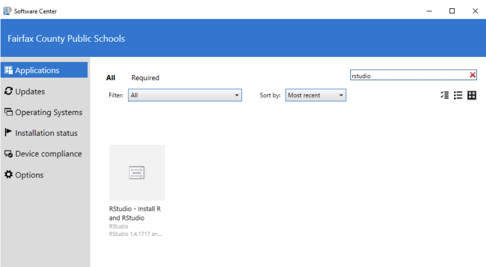
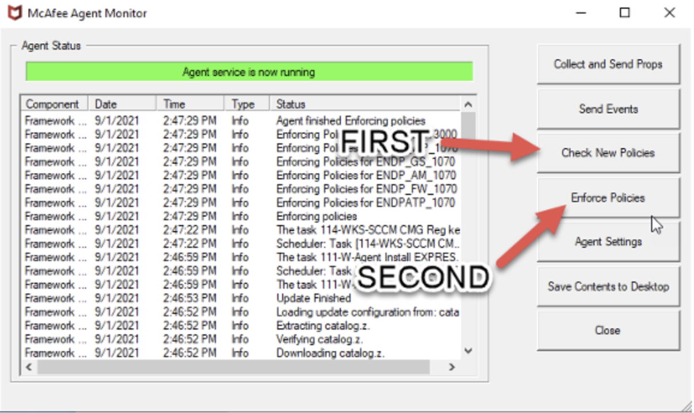
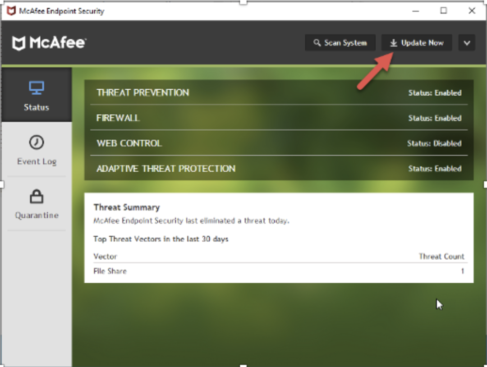

# (PART\*) Getting Started {.unnumbered}

# ⬇️ Installing R and RStudio {-}

You will never interact with R in this class.

Yes, you heard that right. In a class called RS1 with R, you will not be using R. 

```{r, echo = FALSE, fig.cap = "Analogy of difference between R and RStudio."}
knitr::include_graphics("resources/images/00-Getting-Started/R_vs_RStudio_1.png")
```

Though out this book, you will be using R via RStudio. R is to RStudio as a car's engine is to its dashboard.

More precisely, R is a programming language that runs computations, while RStudio is an *integrated development environment (IDE)* that provides an interface with many convenient features. Just as having access to a speedometer, rearview mirrors, and a navigation system makes driving much easier, using RStudio's interface makes using R much easier. 

However, depending on what kind of computer you have, you have two different ways of installing RStudio. 

## Using a Personal Laptop {-}

Download and install R and RStudio (Desktop version) on your computer. 

1. **Do this first:** [Download and install R](https://cloud.r-project.org/). 

2. **Do this second:** [Download and install RStudio Desktop](https://rstudio.com/products/rstudio/download/#download) (the free version).

## Using an FCPS Laptop {-}

FCPS Policy only allows apps to be installed through their version of an App Store called the **Software Center**. Depending on the county and the middle school you come from, you may already be familar with the following procedure. 

1. **Do this first:** Open the Software Center app on your FCPS Laptop. Open the **Start Menu** and type in *Software Center.*

```{r, echo = FALSE, fig.cap = "The FCPS Software Center.", out.width="90%"}
knitr::include_graphics("resources/images/00-Getting-Started/Software_Center.png")
```

2. **Do this second:** In the search box on the **top right,** type **RStudio.**

3. Select the app, and click **Install**. Be patient-- sometimes, the process can take up to 10 minutes.

```{r, echo = FALSE, fig.cap = "RStudio in the Software Center.", out.width="90%"}

```

### Software Center Troubleshooting {-}

If Software Center is taking longer than 10 minutes to install, follow these steps:

1. Sign into your laptop with your FCPS username and password.

2. Once you have signed in and the taskbar has fully loaded, click on the Red Shield Icon in the taskbar seen here: 


  + Next, click **McAfee Agent Status Monitor.**

```{r, echo = FALSE, out.width="40%"}
knitr::include_graphics("resources/images/00-Getting-Started/McAfee_1.png")
```

3. Once the McAfee Agent Status window has loaded, click on **Check New Policies** and then click on **Enforce Policies**.

```{r, echo = FALSE, out.width= "80%"}

```

4. Close out of the McAfee Agent Monitor Window.

5. Click on the Red Shield again. Click on **'McAfee Endpoint Security.'** Let the window load.

  + Click on the **"Update Now"** button on the upper right corner. 

```{r, echo = FALSE, out.width= "70%"}

```


6. Close out of the McAfee Endpoint Security window then head to Software Center to get R Studio installed.  
  + This should go through without a problem this time around. If you are still experiencing issues try restarting your laptop to see if a previous installation was halting you from getting the software installed.


7. If you are still unable to get the software installed please stop by Room 281 during lunch or during 8A (A block of 8th period) for further assistance by a member of the Tech Team.

# 🖥 Interacting with R Studio {-}

::: {.rmdtip}
If you want a slower introduction than we are providing here, check out the short book, [*Getting Used to R, RStudio, and R Markdown*](https://rbasics.netlify.com/). @usedtor2016 include screencast recordings that you can follow along and pause as you learn. They include an introduction to R Markdown, a tool used for reproducible research in R.

:::

## Using RStudio {-}

```{r echo = FALSE, fig.cap = "Icons of R versus RStudio on your computer."}
knitr::include_graphics("resources/images/00-Getting-Started/R_vs_RStudio.png")
```

Much as we don't drive a car by interacting directly with the engine but rather by interacting with elements on the car's dashboard, we won't be using R directly but rather we will use RStudio's interface. After you install R and RStudio on your computer, you'll have two new *programs* (also called *applications*) you can open. Always work in RStudio and not directly in the R application. 

Let's get familiar with RStudio. Open up RStudio. You should see three *panes*, or panels, dividing the screen: the *Console pane*, the *Files pane*, and the *Environment pane*. 


```{r, echo = FALSE}
knitr::include_graphics("resources/images/00-Getting-Started/rstudio_box.png")
```

This is your workspace. Start with the big pane on the left:

```{r, echo = FALSE}
knitr::include_graphics("resources/images/00-Getting-Started/left_window.png")
```

There are three panels (or tabs) in this window, we'll be focusing on the Console and Terminal. When you first start R, the Console gives you some information about your version of R. The Console is where you can type and run R code. For example, if you type 1 + 1 and hit return, the Console returns 2.

Look at the top right:

```{r, echo = FALSE}
knitr::include_graphics("resources/images/00-Getting-Started/top_right_window.png")
```

The main two tabs you'll be using are Environment and Git (which is not yet visible). The Environment tab shows you the datasets and variables you currently have loaded into R. In this case, we loaded in a dataset with 3407 rows and 5 columns and a variable `x` equal to 5. For you, the Environment should be empty. Let's change that. Go to your Console and type:

```{r, eval = FALSE}
x <- 5
```

This assigned the value 5 to an object, x. `<-` is the operator used to assign values to objects in R. Now, hit return/enter and you should see a variable x equal to 5 in your Environment tab. You must always hit return/enter after typing a command, otherwise RStudio will not realize that you want R to execute the command. Look at the bottom right window:

```{r, echo = FALSE}
knitr::include_graphics("resources/images/00-Getting-Started/bottom_right_window.png")
```

The Files tab displays your computer's file system. When you create a project later, this tab will automatically show the contents of your project's folder. The Plots tab will show you a preview of any plots you make in RStudio.

## Packages {-}

R *packages*, also known as *libraries*, extend the power of R by providing additional functions and data. 

```{r echo = FALSE, fig.cap = "Analogy of R versus R packages."}
knitr::include_graphics("resources/images/00-Getting-Started/R_vs_R_packages.png")
```

R is like a new mobile phone: while it has a certain amount of features when you use it for the first time, it doesn't have everything. R packages are like the apps you can download onto your phone. 

Consider an analogy to Instagram. If you have a new phone and want to share a photo with friends. You need to:

1. *Install the app*: Since your phone is new and does not include the Instagram app, you need to download the app. You do this only once. (You might need to do this again in the future when there is an update to the app.)
1. *Open the app*: After you've installed Instagram, you need to open it. You need to do this every time you use the app.

The process is very similar for an R package. You need to:

```{r, echo = FALSE, fig.cap = "Installing versus loading an R package"}
knitr::include_graphics("resources/images/00-Getting-Started/install_vs_load.jpg")
```

1. *Install the package*: This is like installing an app on your phone. Most packages are not installed by default when you install R and RStudio. Thus if you want to use a package for the first time, you need to install it. Once you've installed a package, you likely won't install it again unless you want to update it to a newer version.
1. *"Load" the package*: "Loading" a package is like opening an app on your phone. Packages are not "loaded" by default when you start RStudio. You need to "load" each package you want to use every time you restart RStudio.

### Installing a Package {-}

Install a package which we will need in RS1. At the Console pane within RStudio, type: 

```{r, eval = FALSE}
install.packages("tidyverse")
```

And press return/enter on your keyboard. Note you must include the quotation marks around the name of the package. A package can depend on other packages, which will be automatically installed if needed.

### Loading a Package {-}

::: {.rmdtip}

*You have to load each package you want to use every time you start RStudio.*

:::

Recall that after you've installed a package, you need to "load" it. We do this by using the `library()` command.

For example, to load the **remotes** package, run the following code in the Console. What do we mean by "run the following code"? Either type or copy-and-paste the code into the Console and then hit the enter/return key. 

```{r, eval = FALSE}
library(tidyverse)
```

After running the earlier code, a blinking cursor should appear next to the `>` symbol. (The `>` is the "prompt.") This means you were successful and the **remotes** package is now loaded and ready to use. If, however, you get a red "error message" that reads:

```
Error in library(tidyverse) : there is no package called ‘tidyverse’
```

then you haven't successfully installed the package. If you get this error message, make sure to install the **tidyverse** package before proceeding. 

For historical reasons *packages* are also known as *libraries*, which is why the relevant command for loading them is `library()`.

Note that R will occasionally ask you if you want to install some packages. Almost all the time you do want to, otherwise R would not be asking you. 

### Using a Package {-}

*You have to load each package you want to use every time you start RStudio.* If you don't load a package before attempting to use one of its features, you will see an error message like:

```
Error: could not find function
```

This is a different error message than the one you just saw about a package not having been installed yet. R is telling you that you are trying to use a function in a package that has not yet been loaded. R doesn't know where to "find" the function you want to use. 