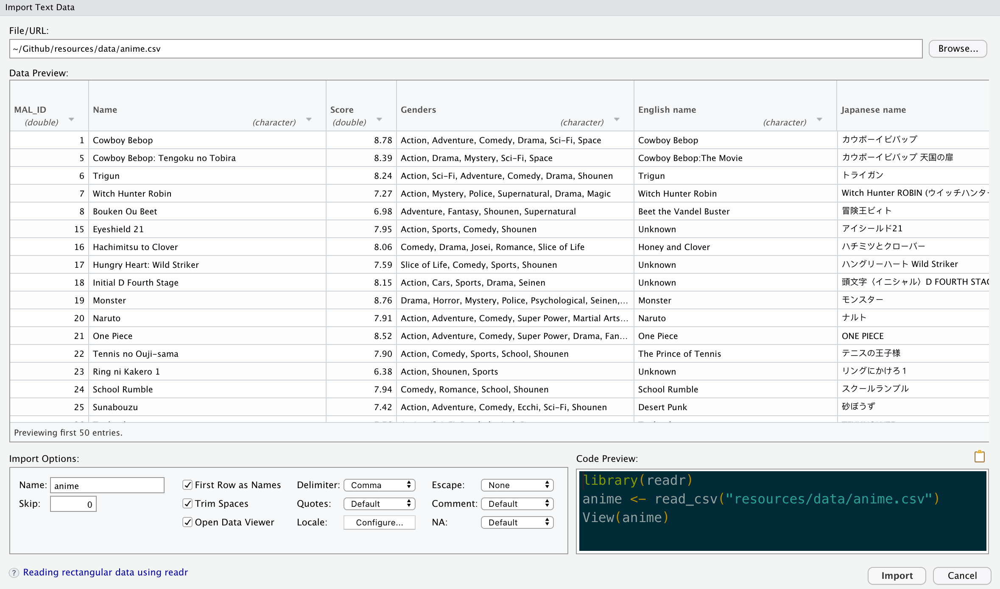

# Creating Dataframes {#dataframe}


## Combining Vectors into Dataframes

In the last chapter, you learned how to create vectors that included elements, either through `c()`, `seq()`, or `:`.

Each vector can be considered a column within a table. So if you want to create a table, you just have to combine the vectors together, right? Let's combine the `friend_names` and `friend_ages` vectors from the previous chapter:

```{r}
friends <- c(friend_names, friend_ages, lives_in_dc)
friends
```

As you can see, all this does is combine two vectors together into a single, longer vector. **It does not give us a table with multiple rows and columns, as expected.**

In order to combine vectors of information into a single data frame, you can use the `data.frame` function:

```{r}
friends <- data.frame(names = friend_names,
           ages = friend_ages,
           DC_Resident = lives_in_dc,
           stringsAsFactors = FALSE)
friends
```

Here, we have created a `names` variable in the `friends` data frame that corresponds to the values in the `friend_names` vector, and similarly an `ages` variable in `friends` that corresponds to the values in `friend_ages`.

Note that all three vectors that we used **were of the same length**. You can check the length by using the `length()` function.

```{r}
c(length(friend_names), length(friend_ages), length(lives_in_dc))
```

### Troubleshooting `data.frame`

If your vectors are not all of equal length, R will return an error.

In my previous example, I had six friends: `Abram, Bryant, Colleen, David, Esther, and Jeremiah`. Let's say that I don't know whether `Jeremiah` lives in DC, so my `lives_in_dc` vector is only a length of 5. I'm overwriting my old lives_in_dc vector with the one below.

```{r, echo=FALSE, results='hide'}
load("~/Github/RGuides/resources/data/friends.Rdata")
```

```{r, error=TRUE}

lives_in_dc<- c(TRUE, FALSE, TRUE, TRUE, FALSE)

c(length(friend_names), length(friend_ages), length(lives_in_dc))

#Combine the dataframe just like I had before. 
friends <- data.frame(names = friend_names,
           ages = friend_ages,
           DC_Resident = lives_in_dc,
           stringsAsFactors = FALSE)

```

At this point, we have a decision to make. You can either fix the mistake and add the data, or you can leave it as `NA`. `NA` is a special value used within R, which we will talk about later.

```{r}
#Force your vector to be a length of 6
lives_in_dc<- c(TRUE, TRUE, FALSE, TRUE, FALSE, NA)

c(length(friend_names), length(friend_ages), length(lives_in_dc))

#Combine the dataframe just like I had before. 
friends <- data.frame(names = friend_names,
           ages = friend_ages,
           DC_Resident = lives_in_dc,
           stringsAsFactors = FALSE)

friends
```

## Importing an Excel or CVS File into R as a Data frame

**XLSX** and **CSV** files are how many datasets are stored. They open through the Excel app. You can tell that they are Excel from its icon:

```{r, echo = FALSE, fig.cap = "Excel File.", out.width="10%"}
knitr::include_graphics("resources/images/00-Getting-Started/XLSX_File.png")
```

You can open these files in Excel to preview the data and perform basic data analysis, but for more serious data analysis, and better control of charts and graphics, we can import them into R.

::: rmdtip
Before you continue, run this command:

```{r}
getwd()
```

Whenever we manipulate a file in R, R assumes that the file is within your **working directory**. Think of the working directory as your desk. If you left your math homework at your desk at home, and you need your mom to take a picture of your work, you need to tell her where you left it.

Unless you give the exact path to a file, R will always assume you are referencing a file in the working directory. For example, on FCPS computers, your default working directory is **Documents**. If you download a CSV file `data.csv`, it automatically goes to your **Downloads** folder instead. To import into Excel, you can only import it with `data.csv` if you move it into your **Documents** folder.

To set your working directory, go to the R Studio Menu \> Session \> Set Working Directory \> Choose Directory.

```{r, echo = FALSE, fig.align='center', out.width="70%"}
knitr::include_graphics("resources/images/00-Getting-Started/setwd.png") 
```
:::

We **strongly suggest** that, once you download your data file, you move it into a folder dedicated to that purpose-- call it "IBET Project" or "RS1 Unit 1 Project" or whatever-- inside your *Documents* folder.

::: rmdwarning
**Do not use OneDrive or Google Drive.** These services will mess up your data.
:::

Importing the dataset itself is easy.

-   **XLSX**: Go to the menu \> File \> Import Dataset \> From Excel.
-   **CSV**: Go to menu \> File \> Import Dataset \> From Text (readr).

```{r, echo = FALSE, fig.align='center', out.width="50%", fig.cap="Navigating to the Import Menu."}
knitr::include_graphics("resources/images/00-Getting-Started/Import_1.png") 
```

1.  In this case, I am using the anime dataset. Click on "browse" to find the file that you want to import into R.

```{r, echo = FALSE, fig.align='center', out.width="90%", fig.cap="The Import Data Window."}
 
```

2.  If everything looks good, click **Import** at the bottom right of the window.

    a.  If you want to change the name of the dataset, do that on the bottom left of the window under "name."

3.  You should now have your dataset imported. Verify that it is correctly imported, on the top right.
