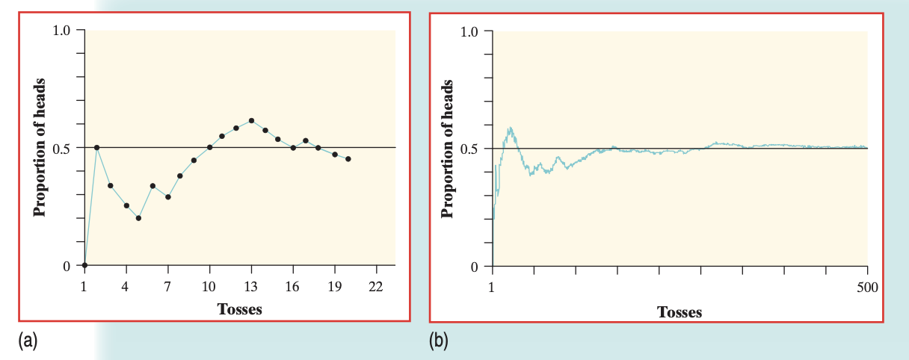

# (PART\*) Sampling and Prbability {.unnumbered}

# Sampling and Probability

## An overview on probability

While a chance process is impossible to predict in the short term, if we observe more and more repetitions of any **chance process**, the proportion of times that a specific outcome occurs approaches a single value. This is called **The Law of Large Numbers**.

```{r, echo = FALSE, fig.align='center', fig.cap="(a) The proportion of heads in the first 20 tosses of a coin. (b) The proportion of heads in the first 500 tosses of a coin."}
 
```

Above is the cumulative proportion of tosses for a fair coin. The previous example confirms that the probability of getting a head when we toss a fair coin is 0.5. Probability 0.5 means “occurs half the time in a very large number of trials.” That **doesn’t** mean that you are always guaranteed 50% heads and 50% tails for any number of tosses!

The Law of Large Numbers, therefore, never guarantees a specific outcome when we observe a chance process—rather, it points out that there the proportion *trends* towards the value that we predict for the chance process.

:::::{.rmdnote}

:::: {style="display: grid; grid-template-columns: 1fr 1fr; grid-column-gap: 10px;"}

::: {}
- <span style="text-decoration:underline">**Empirical**</span> means something based in observation and experience, rather than theory or logic.
- "**Empirical probabilities** come from carrying out a simulation and recording the results. The probability of each event and outcome was the observed relative frequency from the simulation. You found empirical probabilities from Random Babies and Pass the Pigs activity."
:::

::: {}
- <span style="text-decoration:underline">**Theoretical**</span> means something based in logic, rather than observation.
- **Theoretical probabilities** come from constructing a **sample space.**
:::

::::
:::::

:::::{.rmdnote}
:::: {style="display: grid; grid-template-columns: 2fr 1fr; grid-column-gap: 10px;"}
:::{}
The <span style="text-decoration:underline">**sample space**</span> is a list of all possible outcomes. 
- For example, when you toss a die, there are six possible outcomes. If the die is fair, then are all equally likely to occur. So, the sample space S for a fair die is $$S= {1,2,3,4,5,6}.$$ 
:::

::: {}
```{r, echo = FALSE, fig.align='center', fig.cap="All possibilities of a six-sided die."}
knitr::include_graphics("resources/images/08-Sampling-and-Probability/dice.png") 
```
:::
::::
:::::
:::{.rmdnote}
An <span style="text-decoration:underline">**event**</span> is a subset of a sample space.
- For example, the event of “tossing a prime number” in our dice example is the set {2,3,5}. In a sample space with equally likely outcomes, the probability of an event P(E) is $$P(E)=\frac{\text{Number of Outcomes in the Event}}{\text{Total Number of Outcomes in the Sample Space}}$$ 

So, the theoretical probability of tossing a prime number is $\frac{1}{2}$. 

Finally…
-	All events have probabilities between 0 and 1, inclusive.
-	The probability of an impossible event is 0.  
-	The probability of a certain *(guaranteed to happen)* event is 1.

:::

## Performing Simulations

### Carrying out simulations in R using `sample()`

Carrying out a simulation in R is very easy-- much easier to do than using a chance process like dice, a random number generator, and so forth. Like all those other processes though, you must first construct **the sample space**. 

Let's simulate the roll of dice. First, I'll create a new vector that counts from 1 to 6, and store it as `dice`.

```{r}
dice <- 1:6
```

When you run the `sample()` command, R effectively selects an element randomly from the vector-- almost like you placed each vector element on its own index card, and you pull one out. This behavior cannot be changed. 

```{r}
sample(dice, 
       size = 5, 
       replace=FALSE)
```
Here are the parameters, explained:

- `dice= ` is the vector that we are sampling from.
- `size= ` is the number of times that we are sampling from this vector. This is the **sample size**.
- `replace= ` tells R whether to sample for replacement. `FALSE` means sampling **without** replacement. `FALSE` is the default setting; if you do not specify `replace=`, it will assume `FALSE`. What that means is that once R has selected that element, it will exclude that element from the second selection. 

As you can see, it means that every face of the die is selected exactly once. While this works for 6 index cards labeled 1 to 6, it doesn't make sense for dice. We know for a fact that numbers can be repeated on a dice.

:::: {style="display: grid; grid-template-columns: 1fr 1fr; grid-column-gap: 10px;"}

::: {}
Replacing with `replace=TRUE` allows us to properly replicate the chance process of rolling a dice. Here, we roll the dice 7 times. Notice that some numbers repeat.

:::

::: {}


```{r}
sample(dice, 
       size = 5, 
       replace=TRUE)
```
:::
::::

:::: {style="display: grid; grid-template-columns: 2fr 1fr; grid-column-gap: 10px;"}

::: {}
If you kept `replace=FALSE`, and selected a `size=` that was larger than the number of elements in `dice`, you get an error. If you sample without replacement, and you exclude any elements that have already been selected, you select all elements exactly once with `size=6`. There are no more elements beyond 6. 
:::
:::{style="max-width: 340px;"}
```{r, error=TRUE}
sample(dice, 
       size = 7, 
       replace=FALSE)
```
:::
::::

### Sampling from a table using `slice_sample()`

Let's return to our `periodic_table` data from the previous chapter. Given that each row represented an element (in our case, an **observational unit**), we can use the slice_sample() function to select different elements at random.

```{r}
slice_sample(periodic_table, n=5, replace=FALSE)
```

The advantage here over using `sample(1:118, 5)` (since there are 118 rows, and therefore chemical elements, in this table), is that you don't need to choose the data associated with that observation all over again. You can now work with an columns associated with each sampled row, instead of manually selecting it.

Here's another example using \@ref(dplyr-filter) to do more advanced sampling. In our `ChickWeight` scenario, we couldn't just sample each row first, because each row represented a single observation of a chicken by `Day`. Let's say I want to sample 5 chickens, on Diet 1, on Day 18:

```{r}
chicken_sample <- ChickWeight %>%
  dplyr::filter(Time==18, Diet==1)

chicken_sample<- slice_sample(chicken_sample, n=5, replace=FALSE)

chicken_sample

```
Now, we can derive a mean weight from our `chicken_sample` with `mean(chicken_sample$weight)`.

### Repeating Trials

R cannot do everything for us. At every point when we design a simulation, we must make choices.

```{r}
sample(dice, 
       size = 5, 
       replace=TRUE)
```

The code above can be interpreted as taking a single dice, and rolling it five times. That means there are **5 trials** with **1 observation** in each trial.

But an alternative interpretation of the code above is that this is **1 trial** where we threw *5 dice at once, simultaneously.* In this case, it means that, if we want 5 trials, we would have to run the code over and over.

If we were to simulate the probability of throwing multiple dice at once, over multiple trials, we would need to run the `sample()` command over and over. Manually running the command isn't practical, so we use the `replicate()` function instead. 

```{r}
simul_5dice_10trials<- replicate(10, sample(dice,size=5,replace=TRUE))
simul_5dice_10trials
```

`simul_5dice_10trials` represents the simulation of throwing five dice per trial, over ten trials. Therefore, each column represents **one trial**, and each element in the column represents the result of that dice.

**Your turn!** Store the sample space of a 8-sided die into `dice_8`. Then, run a simulation where you throw two 8-sided dice over 6 trials. 

<iframe style="margin:0 auto; min-width: 100%;" id="ch8-sampling-ex" class="interactive" src="https://kaisamng.shinyapps.io/Ch8_Sampling_Ex/" scrolling="no" frameborder="no">

</iframe>


## Tabluating using Two-Way Tables

As we learned in \@(table), we can use the `table()` function to return the counts of a single quantitative variable. Here's an example with the `diamonds` dataset, built into R, which contains the prices and attributes of 54,000 diamonds.

```{r}
head(diamonds)

```

The `diamonds` dataset includes multiple cateogorical variables that describe the quality of a diamond, including `cut`, `color`, and `clairty`. It would be very easy to tabulate each variable at once, by selecting each column as a vector.

```{r}
table(diamonds$cut)
table(diamonds$color)
```

We can go further. What if I wanted to know how many diamonds were both `cut== "Ideal"`and `color== "E"`? In this case, we can pass both variables into R so it *cross-tabulates* the data for us.

```{r}
table(diamonds$cut, diamonds$color)
```

### Deriving Marginal probabilities/ proportions from a two-way table

Now that we have the counts, it is easy for R to find the marginal probabilities from the table. Just pass the entire `table()` output into the `proportions` command.

```{r}
proportions(table(diamonds$cut, diamonds$color))
```

```{=html}
<script>
  iFrameResize({}, ".interactive");
</script>
```


