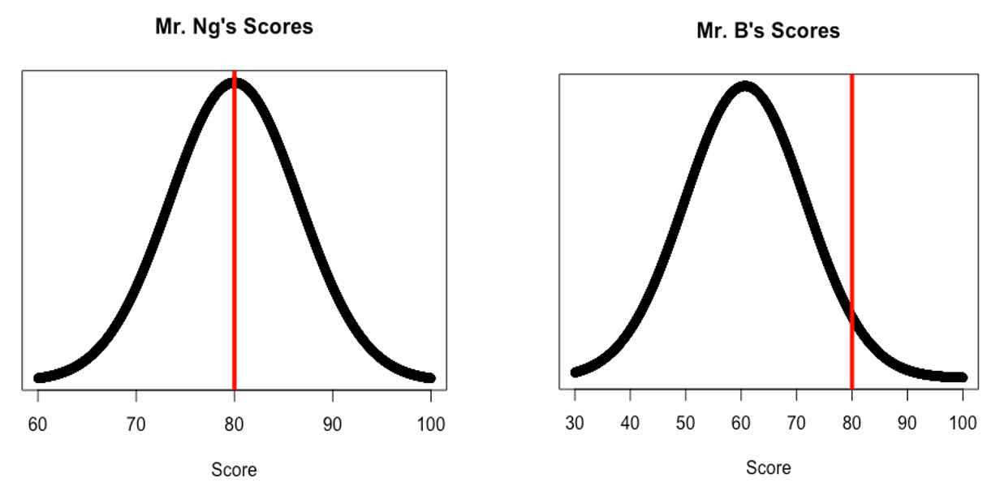
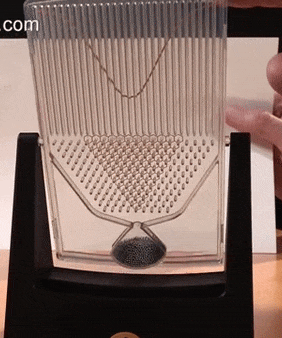
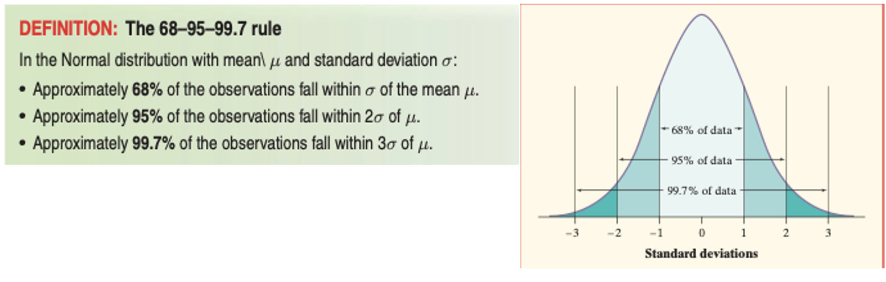
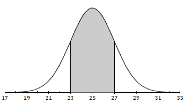

# (PART\*) Sampling Distributions and Confidence Intervals {.unnumbered}

# Z-Scores and the Normal Distribution

## Intro to Z-Scores

Suppose you and your friend just took a TJ Math 3 test. Your math teacher is Mr. Ng, and their teacher is Mr. B. You get your test back, and you’re disappointed with the 80% that you received. 

Weirdly enough, your friend also received an 80%! You assume that your friend and you similarly, since you studied together. Since you studied together and both got 80s, you’re considering dumping your friend as a study buddy. 

“You don’t understand,” they say to you. “I stole this from the TJ Math Teacher’s workroom. Look!”

```{r, echo=FALSE}
ng_b_scores <- data.frame("Ng_Scores"= c(81, 85, 71, 74, 76, 86, 79, 89, 87, 72),
                          "B_Scores"= c(48, 46, 78, 59, 71, 63, 49, 56, 69, 68))
knitr::kable(t(ng_b_scores))

```
Who did better on this test, you or your friend? And how much better did your friend do? 

::: {style="display: grid; grid-template-columns: 1fr 1fr; grid-column-gap: 10px;"}

<div>

We know that not all distributions are the same—even if you took the same test, your friend’s class and your own class had different means, medians, and IQRs, because of variability. In such cases, **comparing different distributions by looking at just values is no longer useful—we must describe the location of that value within the distribution.**

Clearly, a point in Mr. Ng’s class isn’t as valuable as a point in Mr. B’s class. Therefore, a comparison of values isn’t fair, just like how you can’t compare 17 miles and 25 kilometers. The only way to compare is to change the ruler. 
</div>

<div>
```{r, echo=FALSE}

```
</div>

:::

Look at the x-axis: this is how we’re measuring the distribution, as it defines each value in terms of points. Since the points aren’t really worth the same, we need to do is rescale both distributions into consistent units.  Similarly, if you know how to convert between miles and kilometers, then you can actually compare the distances.   

Instead of using points as our ruler, we will use standard deviations. 

```{r, echo=FALSE, out.width="80%"}
knitr::include_graphics("resources/images/11-Sampling-Distributions/zscore_def.png")
```

<!---> TODO: Create Shiny App for students to calculate z-scores<!---->


You might’ve noticed that a bell-shaped curve has been repeatedly drawn as the distribution for all the graphs. This shape is the **Normal Distribution**. 

## The Normal Distribution

::: {style="display: grid; grid-template-columns: 3fr 1fr; grid-column-gap: 20px;"}


<div>

Normal distributions play a large role in statistics, but they are rather special and not at all “normal” in the sense of being usual or typical. We capitalize Normal to remind you that these curves are special.

</div>

<div>
```{r, echo=FALSE}


```

</div>

:::

Normal distributions have several special facts:
-	All Normal curves have the same overall shape: symmetric, single-peaked, bell-shaped. 
-	Any specific Normal curve is completely described by giving its mean μ and its standard deviation $σ$. 
-	The mean is located at the center of the symmetric curve and is the same as the median. Changing μ without changing σ moves the Normal curve along the horizontal axis without changing its spread. 
-	The standard deviation σ controls the spread of a Normal curve. Curves with larger standard deviations are more spread out. 
-	A Normal distribution with a mean $μ=0$ and a standard deviation $σ=1$ is called The Standard Normal Distribution.

In a normal distribution 68% of the values lie within 1 standard deviation of the mean, 95% of the values lie within 2 standard deviations of the mean, and 99.7% of the values lie within 3 standard deviations of the mean.

```{r, echo=FALSE}

```

You can use the Empirical Rule to find probabilities (or the proportion of data) that lies between 2 points. 

Suppose an approximately normal distribution has mean 25 and standard deviation 2. We want to be able to answer the question “What proportion of the data is between 23 and 27 units?” 

::: {style="display: grid; grid-template-columns: 1fr 1fr; grid-column-gap: 10px;"}

<div>
In order to do this, we start with a diagram of the normal curve. 

-	Identify the mean on the x- axis (25). 

-	Mark off lengths of 2 (the standard deviation), starting with the mean as the center. 

</div>

<div>
```{r, echo=FALSE}

```
</div>

:::

Since 23 and 27 are 1 standard deviation above and below the mean, the shaded area is 0.68.

Why can we equate *areas under a curve* with the *probability of getting a z-score greater than or less than $z$*? Part of the reason is because the Normal Distribution is a **density curve**. Imagine that the normal distribution is a picture, and you've zoomed all the way into the picture. Instead of a shaded area, what you'll see instead is a block of pixels. 

In other words, the Normal distribution is like a thick plot of dots. Each dot represents an outcome. The more likely a particular outcome is, the more dots there should be, clustered around that outcome. The less likely an outcome is, the fewer dots are going to be clustered around that area.

Close your eyes and point to a random dot. What's the likelihood that you picked a dot to the left of the mean? If you answered 50%, you're correct. You had a 50% chance of picking a point to the left of the mean, because half of all possible outcomes are to the left of the mean. So, *we can calculate the probability of picking a specific sample that follows the normal distribution.*

What makes this connection powerful is that, if a specific distribution is Normal, and we sample randomly, we can find the probability of picking a sample that is *greater than or less than a specific z-score*. 

### Empirical Rule Practice

<!-- Insert Shiny App Here -->


** You cannot answer the last question with the Empirical Rule.** To find the area under the curve that is to the left of 70 inches, you need some special tools to find these probabilities that between integers. Some tools include:

- Calculus. 
- Luckily, this Calculus has already been done and has been recorded in the **Standard Normal Probabilities Table**. This is Table II on pages T-3 &4 in the back of your textbook.
-Or better yet, using R.

## Solving for Normal Probability Areas given $z$

### Using a z-table

**The Standard Normal Probabilities Table** utilizes the *standard normal distribution*, which has a mean of 0 and a standard deviation of 1.  A portion of the table is reproduced below.  To use the table, you just have to find the z-score for your data value and then look up the z-score on the table to find the probability.

In our previous example, we wanted to find the proportion of American adult men that were below 70.25 inches tall. First, calculate the z-score: $$z= \frac{\bar{x}-\mu}{\sigma}=\frac{5-4}{2}=\frac{1}{2}=0.5$$

Once we calculate a z-score, (remember this is a *standardized score*), we use this score to find the probability.  Label the mean in the center as 0, and label $\pm$3 standard deviations of 1 from the mean.  Then mark the z-score of 0.5 on the number line of the curve and shade all the region under the curve that is to the left of 0.5.

```{r, echo=FALSE}
knitr::include_graphics("resources/images/11-Sampling-Distributions/SNP.png")
```

The probability (the area that you shaded) = 0.6915 or 69.15%.  On the table, the left-hand margin lists the unit’s place and the tenth’s place of the z-score.  The top margin shows the hundredth’s place of the z-score (and also has 0 in the tenth’s place). So, $P(z ≤ 0.50) = 0.6915.$

The solution to this problem is often written $P(\bar{x} < 5) = P(z ≤ 0.50) = 0.6915$ to show the data value from the original distribution.  The question asked “less than”, but there is no difference between “less than” and “less than or equal to” because the “equal to” part is a single line of area which can’t really be measured (even with Calculus!).

### Using R

We can also use `pnorm()` in R to find the areas under the Normal distribution. To solve for the proportion of American men who are less than 70.25 inches tall:

```{r}
#Recall that we found the associated z-score to be z = 0.5:
pnorm(0.5)

#We can also be lazy, and skip solving for the z-score altogether by specifying the mean= and sd= parameters.
pnorm(70.25, mean=69, sd=2.5)


```

Notice that all the methods we've covered assume that the **area is always to the left of $z$**. If you want to find the area to the right of $z$, or $P(X≥z)$, then you need to do $1- P(z≥X)$.

## Solving for $z$ given a probability

We found the probabilities given the z-score—but we sometimes need the reverse. 

To do this, we use the `qnorm()` function in R (Q stands for quantile, another word for percentile—see the connection?).  `qnorm()` finds the z-score for which the area to the left equals the given value.  You are answering the question $P(X < z)= \text{Given Area}$ where you are finding little z. 

For example, what is the highest z-score for heights of adult men  that will mark where the bottom 25%? What you are looking for is the bottom 25% of the shaded area, which is represented by $P(X< z) =0.25$. 


::: {style="display: grid; grid-template-columns: 1fr 1fr; grid-column-gap: 30px; font-size: 0.9em;"}

<div>
Since we don’t know the upper bound, so we need to use `qnorm()`: 
```{r}
qnorm(0.25)
```

```{r, echo=FALSE}
x<- seq(from=-3, to=3, by=0.01)
y<-dnorm(x)
plot(x,y,type="l", main="qnorm(0.25) is a z-score of -0.6744")
x<-seq(-3, qnorm(0.25), length=100)
y<- dnorm(x)
polygon(c(-3, x, qnorm(0.25)), c(0,y,0), col="red")
text(-1, 0.1, "0.25 of area shaded!", col="blue")
```

</div>

<div>
Now that we know that the z-score associated with the left 0.25 of the curve is $z=-0.6744$, that means $P(X<-0.6744)=0.25$. 

Since we used $\mu = 0$ and $\sigma = 1$, the value given is a z-score.  We can then work backwards and discover that: 
$$-0.6744=\frac{x-69}{2.5}$$
$$-1.686=x-69$$
$$ x= 67.314$$

This means any adult man shorter than 67.314 inches falls in the bottom 25% of adult men's heights.

</div>

:::

## Distributions Calculator {#dist-calc}
<!-- TODO: Insert Calculator Here -->


