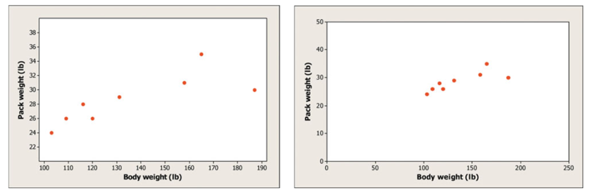

# (PART\*) Linear Regression {.unnumbered}

# Interpreting Scatterplots

## Explanatory and Response Variables, Correlation and Scatterplots

::: {style="display: grid; grid-template-columns: 1fr 1fr; grid-column-gap: 10px;"}
<div>

An **Explanatory Variable** is sometimes referred to as an *independent variable* or a *predictor variable*. This variable explains the variation in the response variable.

</div>

<div>

A **Response Variable** is sometimes referred to as a *dependent variable* or an *outcome variable*. The value of this variable responds to changes in the explanatory variable.

</div>
:::

```{r, echo=FALSE}
knitr::include_graphics("resources/images/11-Linear-Regression/exp-resp.png")
```

The simplest graph for displaying two quantitative variables simultaneously is a **scatterplot**, which uses an x-axis for (traditionally) the explanatory variable, and a y-axis for (traditionally) the response variable.

For each observational pair, a dot is placed at the intersection of its two values.

When we have two quantitative variables, we often want to investigate the relationship between them-- that is, whether the two variables have an *association* with each other.

::: {style="display: grid; grid-template-columns: 1.5fr 1fr; grid-column-gap: 5px;"}
<div>

Let's take a closer look at the scatterplot on the right. This is a scatterplot of the percent of high school graduates in each state who took the SAT and the state's mean SAT Math score in a recent year. We think that "percent taking" will help explain "mean score." So "percent taking" is the explanatory variable and "mean score" is the response variable. What do we see?

</div>

<div>

```{r, echo=FALSE}
knitr::include_graphics("resources/images/11-Linear-Regression/scatter_ex_1.png")
```

</div>
:::

-   The graph shows a clear **direction**: the overall pattern moves from upper left to lower right. That is, states in which higher percents of high school graduates take the SAT tend to have lower mean SAT Math scores. We call this a negative association between the two variables.
-   The **form** of the relationship is slightly curved. More important, most states fall into one of two distinct *clusters.* In about half of the states, 25% or fewer graduates took the SAT. In the other half, more than 40% took the SAT.
-   The **strength** of a relationship in a scatterplot is determined by how closely the points follow a clear form. The overall relationship in the scatterplot is moderately strong: states with similar percents taking the SAT tend to have roughly similar mean SAT Math scores.

Ultimately, what we care about when analyzing scatterplots is **linearity**: whether the data is roughly forming the shape of a line, which allows us to fit a straight line on top. 

## Constructing Scatterplots

Let's return to the `Orange` data. It looks like this:

```{r, echo=FALSE}
knitr::kable(head(Orange))
```

And you can find the documentation here:

```{r, eval=FALSE}
?Orange
```

`age` is represents the age of each tree, and I want to investigate whether the `circumference` is positively correlated with the `age` of the diamond. In that case, I should construct a scatter plot using the `plot()` command.

```{r, fig.cap="A Scatter Plot of Diamond Weight and Diamond Price"}
plot(y= Orange$circumference,
     x= Orange$age,
     main= "Age of Orange Trees vs. Circumference",
     xlab= "Age of Tree (Days since Dec. 31, 1968)",
     ylab= "Trunk Circumference (mm)")

```

Let's do DOFS:

- The direction is clearly positive. As the age of the tree increases, the circumference increases too.
- There doesn't appear to be any major outliers. 
- The form of the scatterplot is roughly linear.
- The strength of the diamonds gets weaker as `age` increases. In other words, it is fan-shaped, which means the *spread* of trunk circumference increases as the age of the Orange trees increases. This is worrisome, because it makes it harder to judge linearity, and decide whether a linear model is appropriate. One explanation, in context, is that all teh trees started off relatively the same, but there were small genetic variations between the trees that became magnified as they grew bigger.

At this point, we have to make a decision. Either we stop here, claiming that a linear model isn't appropriate, or we judge that the increase in variance is not that bad, and enough for us to continue. We'll continue. 

## Correlation

Look at the two scatterplots below. Which one has the stronger association?

```{r, echo=FALSE}

```


Surprise! They actually have the same correlation. Look closely at the scales. One has been stretched out to make the points look "further apart", even though numerically they are the same distance. 

Since it’s easy to be fooled by different scales or by the amount of space around “clouds” of points in a scatterplot, we need a numerical measurement to supplement the graph. **Correlation** is the measure we use.  

```{r, echo=FALSE}
knitr::include_graphics("resources/images/11-Linear-Regression/corr_def.png")
```


::: {style="display: grid; grid-template-columns: 1fr 2fr; grid-column-gap: 5px;"}
<div>

**The correlation coefficient r is always a number between -1 and 1.** In addition:

-	*r* indicates the direction of a linear relationship by its sign: r>0 for a positive association and r<0 for a negative association. 

-	Values of *r* near 0 indicate a very weak linear relationship. 

-	The extreme values $r=-1$ and $r=1$ occur only in the case of a perfect linear relationship, when the points lie exactly along a straight line. 


</div>

<div>

```{r, echo=FALSE}
knitr::include_graphics("resources/images/11-Linear-Regression/corr_exs.png")
```
</div>
:::


To calculate the correlation coefficient in R, use the `cor()` command.

```{r}
cor(y= Orange$circumference,
    x= Orange$age)

```

The correlation coefficient indicates to us that our data is **strongly positive**, and relatively linear. 

### Correlation is not Causation

```{r, echo=FALSE}
knitr::include_graphics("resources/images/11-Linear-Regression/ice_cream_murders.png")
```

If two variables have a strong correlation with each other, all it implies is that they are associated with each other— in other words, it suggests that the two variables have a relationship. 

**It does not guarantee that the two variables have a relationship with each other.** Ice Cream and Murder Rates tend to be higher in the summer, which suggests a relationship. But that doesn't mean that ice cream sends people into a murderous frenzy. 

**The only way to establish causation between two variables is with an experiment.** You will learn more about experimental design later in this course.


<!-- TODO: Insert Correlation Game Here -->


