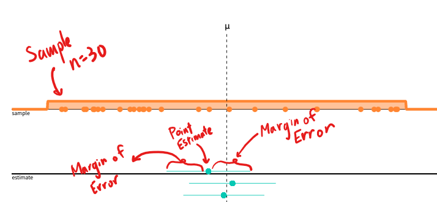
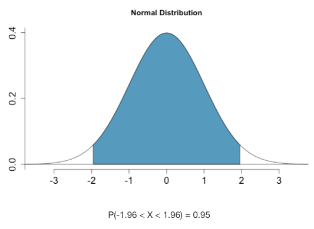
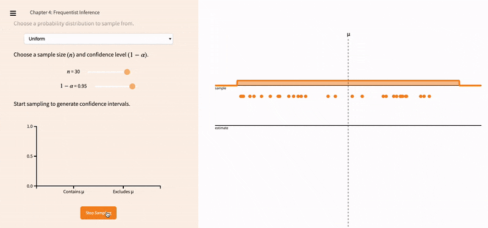

# One Proportion Z-Interval for $\hat{p}$

::: {style="display: grid; grid-template-columns: 6fr 1fr; grid-column-gap: 10px;"}

<div>
Suppose you want to know the true proportion of Freshmen at TJ who've had Boba tea. You select a SRS of 30 students and ask them if they have had Boba tea. You find out that, among your sample, 65% have had Boba tea.

Up to now, the promise in this class that that we'll give you the tools to estimate the true population parameter using only a sample. So now we return to this question: how close were you to the **true** percentage of TJ Freshmen who've ever had Boba tea? 
</div>

<div style="border: none; margin: 0rem;">
```{r, echo=FALSE}
knitr::include_graphics("resources/images/13-One-Prop-CIs/boba.png")
```
</div>

:::

Here's what we know:

- We know that our sample was not biased, because it was an SRS.
- We know that this one sample is part of a sampling distribution, that is approximately normal.
- We know that if we took another sample, our mean sample statistic will be different, because of **sampling variability**.
- **Sampling variability** fundamentally means that we know we can *sort of* trust our sample, but we can't completely trust it-- because we know for a fact that our sample statistic is not *exactly* equal to the true population parameter.


::: {style="display: grid; grid-template-columns: 6fr 1fr; grid-column-gap: 10px;"}

<div>
On top of that, we still don't know how close we are to the sample, because we don't know the population standard deviation. It is completely possible that we got very unlucky, and our sample is completely unrepresentative of the population. The chances that we get an unrepresentative sample with SRS is smaller, but it is not 0. 

If you were to guess the number of jelly beans in a jar, you're more likely to be correct by giving a range of values, rather than a single number. We are more likely to *capture* the "true" population parameter with a *range* of values instead of a single estimate.  This range of values is called a **confidence interval**.
</div>

<div style="border: none; margin: 0rem;">
```{r, echo=FALSE}

```
</div>

:::


## Interpreting Confidence Intervals

Every confidence interval is constructed by using the **point estimate**. The point estimate is the sample statistic that you calculated initially. 

From there, we create an upper and lower bound by adding and subtracting a **margin of error** from the point estimate. In other words:

$$ \text{Confidence Interval}= \text{Point Estimate} \pm \text{Margin of Error}$$

The margin of error, is based on standard deviation of the sampling distribution (as referenced in \@ref(samp-prop) and \@ref(samp-mean)) and the **critical value** derived from the **Confidence Level**. In other words, $\text{Margin of Error}= \text{critical value} * \text{standard deviation of sampling distribution}$ (You do not need to know the Margin of Error calculation yet, as we will revisit this later.)

Graphically speaking, a confidence interval looks like this:

```{r, echo=FALSE, fig.cap="Confidence Interval, Annotated", out.width="70%"}


```


## Interpreting Confidence <u>Levels</u>

Your final grade in this class will be between an F and an A. 

This range guarantees that I am always right about what your final grade in this class is. But it's also useless. 

On the other hand, "your final grade in this class will be between 92.3% and a 92.4%" is incredibly narrow and gives you a lot of info, but also increases the chance that I will be wrong. When we pick a range of values, we need to ensure that it lies in a good middle ground between being too narrow that we don't capture the value, but not too wide that the confidence interval becomes useless.

::: {style="display: grid; grid-template-columns: 1fr 1fr; grid-column-gap: 10px;"}

<div>
A **Confidence Level** determines how "wide" will be in order to properly capture the true population parameter. It is usually 95%, or 99%. The **critical value** is the associated z-score with the middle % of the sampling distribution. 

</div>

<div>
```{r, echo=FALSE, fig.cap="The middle 95% of the Normal distribution is associated with the z-scores 1.96 and -1.96."}


```

</div>

:::

If you repeatedly took samples from the population of size $n$, you can expect that 95% of the confidence intervals that you construct will capture the population parameter. 

```{r, echo=FALSE, fig.cap="Repeatedly creating multiple confidence intervals over and over. THis is a recording from https://seeing-theory.brown.edu/frequentist-inference/index.html#section2"}


```

Notice that, sometimes, we still get an unlucky sample that, even with the wider width, fails to correct capture the true population parameter. That confidence interval is highlighted in red. 

::: {.rmdwarning}
A confidence level of $95%$ does **NOT** mean that the single confidence interval you create has a 95% probability of capturing the true population parameter. 

Your confidence interval either captures the true population parameter, or it doesn't capture it. That probability is either 0% or 100%. 

A 95% confidence interval states that, **over repeated sampling**, around 95% of the confidence intervals you construct will capture the true population parameter.

```{r, echo=FALSE, fig.cap="To say that $\\bar{x} \\pm 10$ is a 95% confidence interval for the population mean $\\mu$ is to say that, in repeated samples, 95% of these intervals will capture $\\mu$."}
knitr::include_graphics("resources/images/13-One-Prop-CIs/CL_Interp.png")

```

:::

If you lower the confidence level, the width of the confidence intervals decreases, and you get more red confidence intervals.

```{r, echo=FALSE, fig.cap="Lowering the confidence level leads to more precise intervals, but increases the likelihood of not correctlly capturing the population parameter."}
knitr::include_graphics("resources/images/13-One-Prop-CIs/35CI.gif")

```


## Confidence Intervals of One Proportion

Let's do an example problem.

::: {.rmdnote}

Sleep Awareness Week begins in the spring with the release of the National Sleep Foundation’s annual poll of U.S. sleep habits and ends with the beginning of daylight savings time, when most people lose an hour of sleep. In the foundation’s simple random sample of 1029 U.S. adults, 48% reported that they “often or always” got enough sleep during the last 7 nights.

Construct a 98% confidence interval for the proportion of adults that "often or always" got enough sleep during the last 7 nights.

:::

In every method of statistical inference (where we try to draw conclusions about a population based on a sample), we follow the four step process of **State, Plan, Do, Conclude**.

### State

Use this sentence stem:

:::{.rmdtip}

We want to construct a One-Proportion Z-Interval for the proportion of adults who "often or always" get enough sleep during the last 7 nights, with 98% confidence.

:::

Then, list out statistics that are important to the problem:

> n=1029

> $\hat{p}= 0.48

### Plan: Check for Conditions {#One-Prop-Conditions}

:::{.rmdtip}

Before we figure out what the appropriate **Critical Value** is associated with a 98% confidence level, we need to ensure that the sampling distribution follows the normal distribution. There are three conditions you need to check for:

- **Random**: The sample must be a random sample. This diminishes sampling bias.

- **Normal**: $np \ge 10$ and $n(1-p) \ge 10$. This generally helps us fulfill the central limit theorem, so the sampling distribution of $\hat{p}$ is approximately Normal. **Both these numbers should be integers, since they represent counts in the sample.** If you get something that is very close to an integer, attribute it to rounding error.

- **Independent (10% Condition)**: The number of successes (observational units in $\hat{p}$) and the number of failures (observation units *not* in $\hat{p}$) must be less than 10% of the population. This is necessary because if your sample size is too large, then that increases the lik elihood that the same observational units will be selected for multiple samples. That increases the chances that the samples will have response bias.

:::

Let's see how this works in our example:

> **Random**: The sample of 1029 US adults was randomly selected. ✅


> **Normal**: To use a Normal approximation for the sampling distribution of $\hat{p}$, we need both $np$ and $n(1-p)$. Since we don't know $p$, we use $\hat{p}$ instead. ✅

> We check that $np = 1029(0.48)= 494 \ge 10$ and $n(1-p) = 1029(1-0.48) =535 \ge 10$. Since both are greater than 10, we meet this condition. 

> **Independent**: If our is sample size $n=1029$ is exactly 10% of the population, then that means the smallest possible population size is $10*1029=10290$. Given that we know that there are way more than 10,290 adults in the U.S., it is reasonable to assume that our sample size is less than 10% of the population. ✅


Since we pass all three conditions, we can continue.


### Do

Let's start off with talking about how to the confidence interval manually.

First, we need to calculate the critical value **$z^*$ **. If our confidence level is the middle 98% of the normal distribution, that means 2% is outside the middle 98%. Thus, there is 1% remaining on either side of the tail.

```{r, echo=FALSE}
x<- seq(from=-3, to=3, by=0.01)
y<-dnorm(x)
plot(x,y,type="l", main="Middle 98% of the Normal Distribution", yaxt="n", ylab="", )
x<-seq(qnorm(0.01), qnorm(0.99), length=100)
y<- dnorm(x)
polygon(c(qnorm(0.01), x, qnorm(0.99)), c(0,y,0), col="lightblue")
text(0, 0.1, "Middle 98%", col="red")
text(-2.7, 0.05, "Area= 0.01", col="red")
text(2.7, 0.05, "Area= 0.01", col= "red")
mtext("z*= -2.32", side=1, line=-1, at=-2.3)
mtext("z*= +2.32", side=1, line=-1, at=2.3)
```

To do this, use the `qnorm()` function.

```{r}
qnorm(0.01)
qnorm(0.99)

```

Notice that they are both the same magnitude, so we only take the positive value. 

Next, calculate the margin of error. For a One-Sample Z-Interval, the formula is:

::: {.rmdtip}

$$ \text{Margin of Error}= z^* \sqrt{\frac{p(1-p)}{n}}$$

:::

Plugging in the numbers from our example, we have:

::: {.rmd1fr1fr}

<div>
**Mathematically:**

$$ \text{Margin of Error}= \\ 2.326 * \sqrt{\frac{0.48(1-0.58)}{1029}} \\= 0.036231 $$

</div>

<div>
**R Code**

```{r}
moe<- 2.326 * sqrt((0.48)*(1-0.48)/1029)
moe
```

</div>

:::

::::{.rmdtip}

Finally, we can create a 98% confidence interval.

:::{.rmd1fr1fr}

<div>

```{r}
#Lower Bound
0.48- moe
```

</div>

<div>

```{r}
#Upper Bound
0.48+ moe
```

</div>

:::


$$ \text{98% CI}= \hat{p} \pm \text{M.o.E}= 0.48 \pm 0.036231 =  [0.4437683, 0.5162317]$$
::::

### Conclude

::: {.rmdtip}

Now we want to interpret the confidence interval in context. Use this sentence starter:

 We are _____% Confident that the interval from _______ to _____ captures the true ________.

:::

In our example, it's:

> We are 98% Confident that the interval from 0.44377 to 0.51623 captures the true proportion of U.S. adults who "often or always" get enough sleep in the past 7 nights. 

**You must always use context.** Failure to do so would mean lost points. 

## In R {#one-prop-z-test-R}

Finally, there is a built-in way to do this in R, using the `prop.test()` command. Instead of inputting the actual $\hat{p}$, however, you input the count of "successes" within the context of the problem. If 48% of U.S. Adults report that they "often or always" get enough sleep, then $0.48*1029=493.92$, which we round up to $494$ and attribute the decimal to rounding error.

```{r, eval=FALSE}
prop.test(x= 494,
          n=1029,
          conf.level = 0.98,
          correct=FALSE)
```

```{r, echo=FALSE}
knitr::include_graphics("resources/images/13-One-Prop-CIs/R_One_Prop_CI.png")
```


:::{.rmdwarning}

Regardless of whether you calculate the interval by hand or through R, or the TI-84, you **must** complete the State, Plan, and Conclude portions as shown. Failure to do so results in lost points.

:::

## One Proportion Confidence Interval Practice

<iframe style="margin:0 auto; min-width: 100%;" id="ch6-hist-ex" class="interactive" src="https://kaisamng.shinyapps.io/Ch13_One_Prop_Z_Practice/" scrolling="no" frameborder="no">

</iframe>


```{=html}
<script>
  iFrameResize({}, ".interactive");
</script>
```


