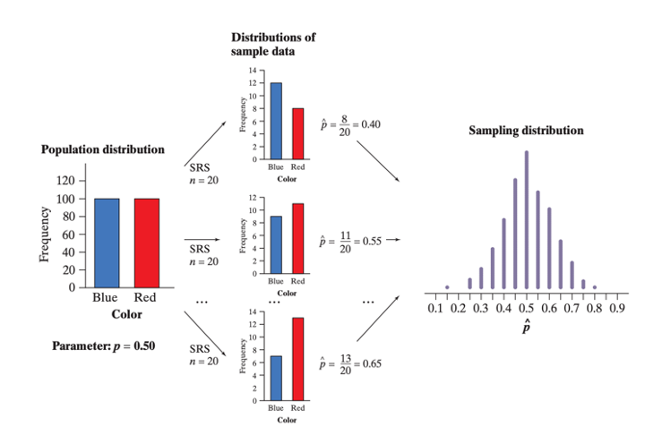

# The Central Limit Theorem

## Review: Parameter vs. Statistic

::::{.rmdimportant}

**Remember:**

::: {style="display: grid; grid-template-columns: 1fr 1fr; grid-column-gap: 10px;"}

<div>
A **parameter** is a number that describes some characteristic of the population. In real life, the value of a parameter is usually not known because we cannot examine the entire population.
</div>

<div>

A **statistic** is a number that describes some characteristic of a sample. The value of a statistic can be computed directly from the sample data. We often use a statistic to estimate an unknown parameter.

</div>

:::

::::

In order to distinguish between a parameter and a sample, we use the appropriate symbol. A table of those is reproduced below. 

```{r, echo=FALSE}

symbol_table<- data.frame(symbols= c("Mean", "Proportion", "Standard Deviation"),
                          para= c("$\\mu$", "$p$", "$\\sigma$"),
                          sta= c("$\\bar{x}$", "$\\hat{p}$", "$s$"))

colnames(symbol_table) <- c("Symbols", "Parameter \\\n Population", "Statistic \\\n Sample")

kable(symbol_table, escape=FALSE)
```

How can $\bar{x}$, based on a sample of only a few of the 117 million American households, be an accurate estimate of $\mu$? After all, a second random sample taken at the same time would choose different households and likely produce a different value of $\bar{x}$. This basic fact is called **sampling variability**: the value of a statistic varies in repeated random sampling. 

To make sense of sampling variability, we ask, “what would happen if we took many samples?” Here’s how to answer that question:

- Take a large number of samples from the same population.

- Calculate the statistic (like the sample mean $\bar{x}$  or sample proportion $\hat{p}$) for each sample.

- Make a graph of the values of the statistic.

- Examine the distribution displayed in the graph for shape, center, and spread, as well as outliers or other deviations.


## The Sampling Distribution

In the applet below...

1. Click the "Animated sample" button. Five scores from a normal distribution will be sampled and plotted in a histogram. The mean of the sample will be computed and plotted in a second histogram. Repeat this 3 or 4 times or until you understand the how the "Distribution of Means" is created. The red line extends from the mean one standard deviation in each directon. The colored vertical bars on the X-axis correspond to the statistic of the same color.

2. Click the "5 samples" button to sample 5 samples of 5 scores each. The five means will be plotted. Click the "500 samples" and/or "2000 samples" until the distribution of means has stabilized. The sampling distribution of the mean is the distribution that is approached as the number of samples approaches infinity. With 5,000 to 10,000 you get a pretty good approximation.

3. The distribution plotted in (2) above is the sampling distribution of the mean of a sample size of 5. Approximate the sampling distribution of the mean for other sample sizes.

4. Any statistic you can compute in a sample has a sampling distribution. Approximate the sampling distribution of other statistics. The statistics available to compute are:

- Mean
- Median
- Standard deviation (sd) (Using N in the denominator)

```{=html}
<iframe style="margin:0 auto; min-width: 727px; min-height: 511px;" id="ch5-6-exercises" class="interactive" src="https://onlinestatbook.com/stat_sim/samp_dist_js/index.html" scrolling="no" frameborder="no">

</iframe>
```

## The Central Limit Theorem

Draw an SRS of size $n$ from any population with mean $μ$. The **central limit theorem (CLT)** says that when n is large, the sampling distribution of the sample mean $\bar{x}$ is approximately normal. 


```{r, echo=FALSE, out.width="90%"}
knitr::include_graphics("resources/images/14-CLT/CLT_def.png")
```

## The Sampling Distribution of Sample Means {#samp-mean}

Choose a SRS of size $n$ from a population with mean $\mu$ and standard deviation $\sigma$. If $n \ge 30$, then the distribution of sample means $\bar{x}$ will also be approximately Normal, even if the population is not.

- The distribution of sample means $\bar{x}$ will center at $\mu$. In other words, $\mu_\bar{x} = \mu$.

- The distribution of sample means will have a standard deviation of $\frac{\sigma}{\sqrt{n}}$.

::: {.rmdimportant}

**The Normal Condition for Sample Means:**

- If the population distribution is Normal, then so is the sampling distribution of $\bar{x}$. This is true no matter what the sample size $n$ is.

- If the population distribution is not Normal, the CLT tells us that the sampling distribution of $\bar{x}$ will be approximately Normal in most cases, if $n \ge 30$. 

:::


## The Sampling Distribution of Sample Proportions 

The central limit theorem provides an incredible fact: if we want to measure a variable of interest within a population, we don’t need to take a census. Instead, if we sample repeatedly, in large amounts, then we have a very good estimate of the population’s true parameters. But as the figure below shows, there are actually three distinct distributions involved when we sample repeatedly.

Consider a bag of 200 chips: 100 red, and 100 blue. The variable of interest is the proportion of red chips in the bag.

```{r, echo=FALSE, out.width="90%", fig.cap="The process of creating a Sampling Distribution of Proportions."}

```

-	The population distribution gives the values of the variable (proportion of red chips) for all the individuals in the population. In this case, that’s 50%. 

-	The distribution of sample data shows the values of the variable (proportion of red chips) for the individuals in the sample. For each sample, we record a value for the statistic $\hat{p}$.

-	Finally, we collect the values of $\hat{p}$  from all possible samples of the same size, and display them in the sampling distribution. 


:::{.rmdwarning}

**Be careful! The population distribution** and the **distribution of sample data** describe individuals. **A sampling distribution** describes how a statistic varies in many samples from the population. 

:::


Notice that, in this example, we are calculating **proportions**, rather than *means*. We use proportions because we are using categorical data, rather than quantitative data, and you can’t calculate the average of blue and red. 

It turns out that this still follows the same laws of the central limit theorem! However, instead of the mean of the sample means being equal to the true population mean, **the mean of the sample proportions equals to the true population proportion**. While the mean of any sampling distribution is a statistic, if that statistic equals to the population parameter, we call it an *unbiased estimator*.


### The Sampling Distribution of Sample Proportions {#samp-prop}

::: {.rmdimportant}

Choose a SRS of size n from a population with proportion p of successes. Let $\hat{p}$ be the sample proportion of successes. If the sample’s size $n$ is less than 10% of the population, then the distributions of sample proportions $\hat{p}$ will be approximately Normal, even if the population is not.

- The distribution of sample proportions $\hat{p}$ will center at $p$. In other words, $\mu_\hat{p} = p$.

- The distribution of sample proportions will have a standard deviation of $\sigma_\hat{p}=\sqrt{\frac{p(1-p)}{n}}$, where $p$ is the true proportion parameter.

:::

Now that we have a better understanding of sampling distributions, we can move onto Confidence Intervals. 


```{=html}
<script>
  iFrameResize({}, ".interactive");
</script>
```
