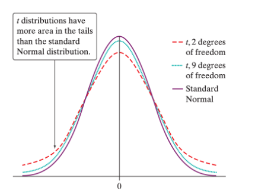

# One Sample t-Interval for $\mu$

## The t-distribution

```{r, echo=FALSE}
knitr::include_app("https://www.youtube.com/embed/Ea4_eX--mIY?start=10")

```

:::: {.rmdnote}

::: {style="display: grid; grid-template-columns: 1fr 3fr; grid-column-gap: 5%;"}
<div>

**Proportions= Normal Distribution (z-distribution)**

Confidence Intervals for a *population* proportion $p$ are based on z-values from the standard Normal distribution.

Proportions are really simple to work with, because they’re always standardized—the largest decimal is 1, and the smallest is 0. This means that we don’t have to worry about the spread of the population as much.  

</div>

<div>

**Means= $t$-distribution**

Means can take any value—they could be negative, they could be 78, they could be 10,000. As a result, the sampling distribution for means naturally has a larger **spread— <u>this means that the sampling distribution is no longer normal.**</u>

```{r, echo=FALSE}
knitr::include_graphics("resources/images/14-One-Sample-CIs/Norm_vs_t.png")
```

When we only know the sample’s standard deviation $s_x$—so not the population standard deviation $\sigma$—the distribution takes on a new shape called the t-distribution. You can see a comparison above. 

The t-distribution has a much larger spread than the normal distribution does—this is to account for the naturally larger spread that sample means would have. 

</div>

:::

::::

The $t$-distributions are a family of symmetric, bell-shaped distributions that are centered at 0, but whose spread is determined by its **degrees of freedom**. The **area of those tails depends on the degrees of freedom the sampling distribution has.** The larger the sample, the closer the t-distribution will get to the Normal distribution. The smaller the sample, the greater its varability, and so the t-distribution compenstates by adding more area in its tails.

::: {style="display: grid; grid-template-columns: 1fr 1fr; grid-column-gap: 5px;"}

<div>

When we talk about z-scores within the t-distribution (e.g. how many standard deviations a data point is away from the mean), we still use the same formula, but we now call them **t-values**, to differentiate them from the Normal distribution. 
</div>

<div>
```{r, echo=FALSE}

```
</div>

:::

## Finding areas under the $t$-distribution

Just like how in \@ref(norm-dist-area) we used  `pnorm()` to find areas given a $z$-score, and `qnorm()` to find $z$ given a area, we can use `pt()` and `qt()` to find the t-distribution.

```{r, echo=FALSE}

pq_table<- data.frame(dist= c("Normal ($z$)", "$t$"),
                          area= c("`pnorm()`", "`pt()`"),
                          zt= c("`qnorm()`", "`qt()`"))

colnames(pq_table) <- c("", "Find Area, \\\n given $z$ or $t$", "Find $z$ or $t$, \\\n given Area")

kable(pq_table, escape=FALSE)
```

In both cases, **R will always calculate the cumulative area starting from the left** of the distribution. 

::: {.rmd1fr1fr}

<div>

To find any area under the $t$-distribution, you need the $t$-value and the degrees of freedom. 
```{r}
pt(0, df=14)

pt(1.25, df =3)

```
</div>

<div>
Similarly, to find a corresponding t-value given an area, use `qt()`.

```{r}
qt(0.5, df=14)

qt(0.85, df=3)

```
</div>

:::


## One Sample Confidence Interval for $\mu$

Confidence Intervals for a population mean $\mu$ use a **t-distribution** with $n-1$ degrees of freedom. Let's do an example problem:

::: {.rmdnote}

Biologists studying the healing of skin wounds measured the rate at which new cells closed a cut made in the skin of an anesthetized newt. Here are data from a random sample of 18 newts, measured in micrometers (millionths of a meter) per hour:

`29 27 34 40 22 28 14 35 26 35 12 30 23 18 11 22 23 33`

Calculate and interpret a 95% confidence interval for the mean healing rate µ.

:::


