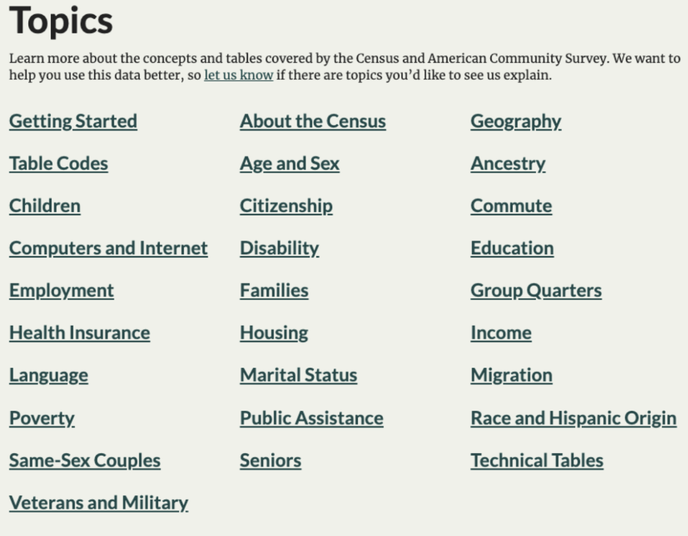
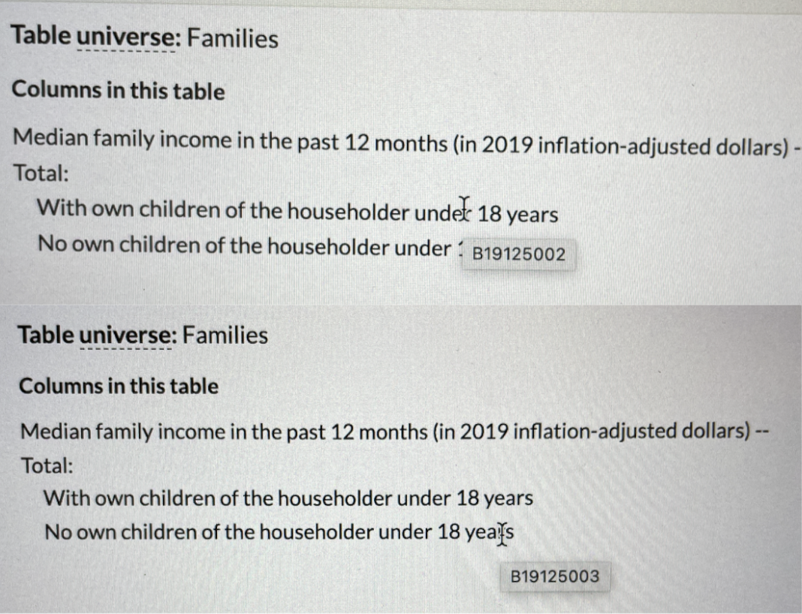

# 📲️ Downloading Data from the Census Bureau {-}

The Census Bureau is one of the richest sources of data about Americans. Best of all, it's free! 

## Register for a Census Bureau Key {-}

::: {style="display: grid; grid-template-columns: 1fr 1fr; grid-column-gap: 10px;"}
<div>

1. Go to [Key Signup](https://api.census.gov/data/key_signup.html) and signup for a key. **DO NOT Use your FCPS email, otherwise, the email will be blocked :(**

2. Wait a minute, and check your email. **Click on the link to activate your key, otherwise the next steps won't work!**
</div>

<div>

```{r, echo=FALSE}
knitr::include_graphics("resources/images/A-Downloading-from-Census/census_key.png")
```
</div>
:::

## Install the `tidycensus` package {-}

The package that easily downloads Census Bureau data is called `tidycensus`. Install the package and load it.

```{r eval=FALSE,echo=TRUE, message=FALSE, warning=FALSE, results='hide'}
install.packages("tidycensus")
library("tidycensus")
```

Then, install your Census API Key into R with this command.

```{r eval=FALSE}
census_api_key("<Census Key Goes Here>", install=TRUE, overwrite=TRUE)
```

Restart your R Session by clicking on Menu's Session >> Restart R Session. Then, reload the tidycensus library by running `library("tidycensus")`.

## Picking Variables from the Census {-}

There are many datasets and tables that you can pull from the Census Bureau, but we're only going to focus on one-- the Census Bureau’s **5-Year American Community Survey (ACS)**.

The ACS is a massive dataset that the Federal Government publishes every year about the characteristics of households that live in a neighborhood. This survey is used by government agencies, corporations, non-profit groups, and policymakers to make decisions about certain neighborhoods, or give money to certain neighborhoods over others. 

A household is described as a family unit. If you, your mom, your sister, and your grandfather live under one roof, then you are considered a household. The ACS counts the number of households that meet a variable’s criteria. 

For example, if the zip code 22312 in a table called “Households who own a smartphone only” has a value of 2954, that means that there are 2954 households in the zip code 22312 that own just smartphones. 

You can easily find a specific variable from the Census Bureau by using a website like [Census Reporter](https://censusreporter.org/). 

::: {style="display: grid; grid-template-columns: 1fr 1fr; grid-column-gap: 10px;"}
<div>
1. The easiest way to start exploring variables is to scroll down to the topics section. Pick a topic that interests you.
</div>

<div>
```{r, echo=FALSE}

```
</div>

:::

::: {style="display: grid; grid-template-columns: 1fr 1fr; grid-column-gap: 10px;"}
<div>
2. For demonstration purposes, I chose income. This website has a great curation of Census tables with interesting topics. I’m interested in B19125: Median Family Income by Presence of Own Children. Click it. 
</div>

<div>
```{r, echo=FALSE}
knitr::include_graphics("resources/images/A-Downloading-from-Census/census_reporter_2.png")
```
</div>
:::

::: {style="display: grid; grid-template-columns: 1fr 1fr; grid-column-gap: 10px;"}
<div>
3. To get the **variable code**, *hover* your mouse over the variables you’re interested in, and a pop up will appear near your mouse. 

In this case, I’m interested in the median household income households with children: that’s B19125002, and households with no children: B19125003. 
</div>
<div>
```{r, echo=FALSE}

```
</div>
:::

## Pull data from the Census {-}

Since this is data from the ACS, we will use the `get_acs()` command from the `tidycensus` package.

:::{.rmdwarning}
*In order for your variable to parse correctly in tidycensus, you’ll need to place a hyphen before the last three digits. So “B19125002” becomes “B19125_002”, and “B19125003” becomes “B19125_003”.
:::

* Notice the "geography" is "zcta," which is the Census Bureau's equivalent of a ZIP Code. 

* state="VA" variable helps limit the scope of our data to just VA, otherwise it will download all US.

```{r, eval=FALSE, results='hide'}
income_with_children <- get_acs(geography="zcta",
                  state="VA",
                  variables=c("B19125_002"),
                  year=2019)

head(income_with_children)

income_no_children<- get_acs(geography="zcta",
                            state="VA",
                            variables=c("B19125_003"),
                            year=2019)
head(income_no_children)
```

And there you have it-- data from the census!

```{r, echo=FALSE, fig.cap="Zip Code Data for Household Income for Households with Children, and Without Children"}
load("~/Github/RGuides/resources/data/Census_Data.RData")
knitr::kable(list(income_with_children, income_no_children), caption="Zip Code Data for Household Income for Households with Children, and Without Children", booktabs=TRUE) %>%
  scroll_box(height="500px") %>%
  kable_styling(position= "center", font_size = 10)
```