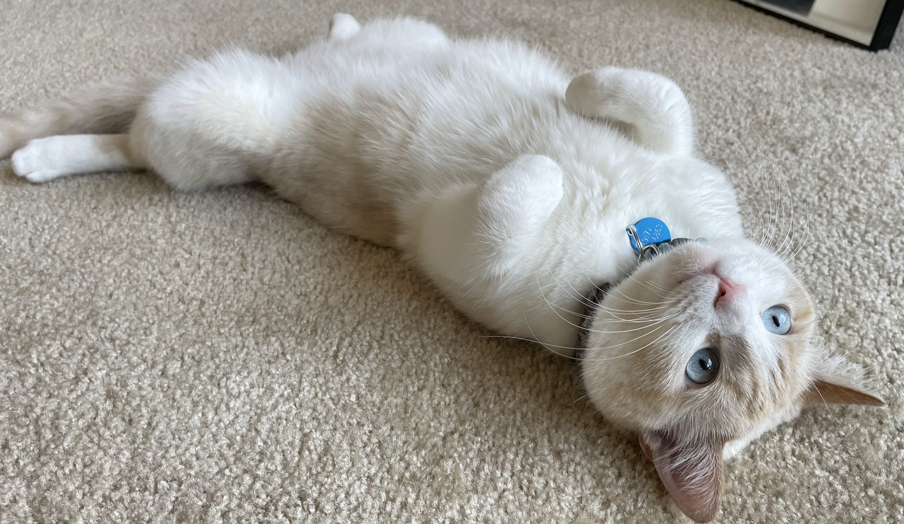
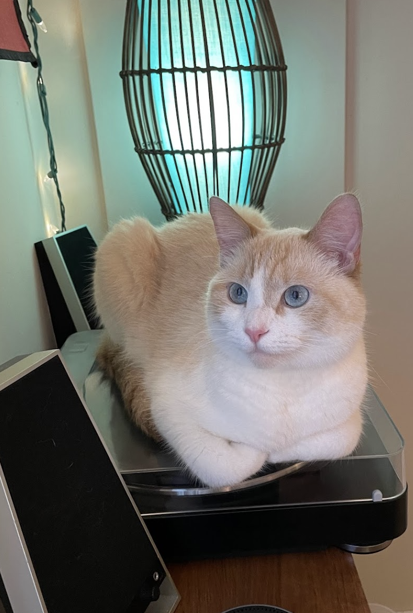

# Homepage {.unnumbered}

This website serves as a digital companion for TJ students taking RS1, or any other TJ students who need a quick intro to data science.

## General Guidelines to Start {.unnumbered}

1.  Like mathematics, there are many different ways to get to the same point. The advantage of R is that it is easily accessible to everyone to learn, and easily accessible for everyone to develop. It is easy for someone to code and publish their own approach to a problem.

    a.  This turns out to be both a blessing and a curse. We offer *one* way to clean your data, run a t-test, etc. Chances are that, if you google your problem, you will find someone with completely different code. That code is just as good as the code we include here.

    b.  In fact, we actively encourage you to find different ways of doing code, if it makes sense to you. R is a vast, wide, universe. Go out there and explore.

2.  **Three Before Me Rule:**. If you encounter a problem you are expected to ask three people before you ask your teacher. Some people you can ask are:

    -   Google (Stack Overflow).

    -   A friend.

    -   The search bar in the textbook.

    -   Another friend. An older student. Your brother. Heck, even your parents.

## Acknowledgements {.unnumbered}

Materials and format here are heavily inspired and borrowed from @kane2022, @heiss_2022, and @starnes_yates_moore_2012. LearnR and related javascript magic was inspired by @de_leon_2022.

Almost everything else was written by Mr. Ng and Mr. McFee.

Credit also goes to the main supervisor of this project, Casper. As a lover of warm laptops *(Intel Processors Only)*, smoked salmon, meowing to go outside, human attention, sitting on top of TJ Math Final Exams, and lying on his back in this weird fashion, he has been the patron saint of all TJ Math students for the past 3 years.

::: {style="display: grid; grid-template-columns: 1fr 1fr; grid-column-gap: 10px;"}
<div>

```{r, echo = FALSE, fig.align='center'}
 
```

```{r, echo = FALSE, fig.align='center'}
knitr::include_graphics("resources/images/casper_keyboard.png") 
```

</div>

<div>

```{r, echo = FALSE, fig.align='center'}
knitr::include_graphics("resources/images/casper_test.png") 
```

</div>

<div>

```{r, echo = FALSE, fig.align='center'}
knitr::include_graphics("resources/images/casper_fan.png") 
```

</div>

<div>

```{r, echo = FALSE, fig.align='center'}
 
```

</div>
:::
